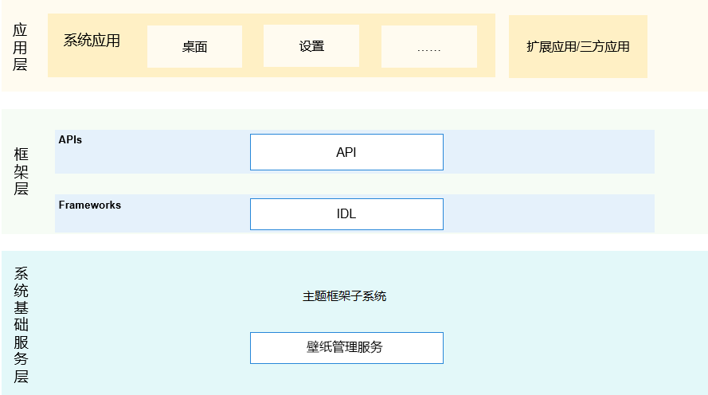

# 主题框架子系统/壁纸管理服务

## 简介

### 内容介绍
该仓主要为系统提供壁纸管理服务能力，支持系统显示、设置、切换壁纸等功能。

### 架构图介绍
**图 1** 子系统架构图  


#### 仓路径

/base/theme/wallpaper_mgr

## 目录

```
/base/theme/wallpaper_mgr
├── figures                  # 架构图
├── frameworks
│   ├── js/napi              # js接口解析成napi接口
│   ├── kits/extension       # extension扩展
│   └── native               # 对客户端提供的接口
├── services                 # 壁纸管理服务实现
│   ├── profile              # 组件包含的系统服务的配置文件
│   └── etc                  # 组件包含的进程的配置文件
├── test                     # 接口的单元测试
└── utils                    # 组件包含日志打印和有序公共事件定义的常量
```
## 说明

### 接口说明

-   Wallpaper接口文档
    -   [js-apis-wallpaper.md](https://gitee.com/openharmony/docs/blob/master/zh-cn/application-dev/reference/apis/js-apis-wallpaper.md) 提供从API version 7开始的接口定义和示例代码。

## 相关仓

**主题框架子系统**

[theme_wallpaper_mgr](https://gitee.com/openharmony/theme_wallpaper_mgr)

